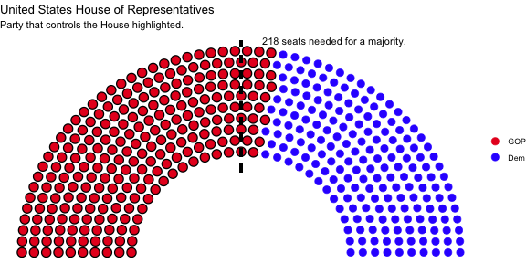
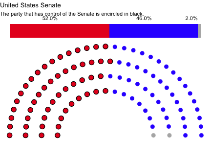
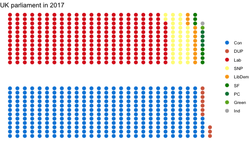

<!-- README.md is generated from README.Rmd. Please edit that file -->


# ggparliament 

# Parliament plots


This package attempts to implement "parliament plots" - visual representations of the composition of legislatures that display seats colour-coded by party. The input is a data frame containing one row per party, with columns representing party name/label and number of seats, respectively.

This `R` package is a `ggplot2` extension.

To install the package:

```r
devtools::install_github("robwhickman/ggparliament")
```

Inspiration from this package comes from: [parliamentdiagram](https://github.com/slashme/parliamentdiagram), which
is used on Wikipedia, [parliament-svg](https://github.com/juliuste/parliament-svg), which is a javascript clone, and [a discussion on StackOverflow](http://stackoverflow.com/questions/42729174/creating-a-half-donut-or-parliamentary-seating-chart), which provided some of the code for part for the "arc" representations used in this package.


If you have any issues, please note the problem and inform us!

## Semicircle parliament

### EU, France, United States, and so on...


### Plot of US House of Representatives


```r
#filter the election data for the most recent US House of Representatives
us_house <- election_data %>%
  filter(country == "USA" &
    year == 2016 &
    house == "Representatives")

us_house <- parliament_data(election_data = us_house,
  type = "semicircle",
  parl_rows = 10,
  party_seats = us_house$seats)

us_senate <- election_data %>%
  filter(country == "USA" &
    year == 2016 &
    house == "Senate")

us_senate <- parliament_data(
  election_data = us_senate,
  type = "semicircle",
  parl_rows = 4,
  party_seats = us_senate$seats)
```


```r
ggplot(us_house, aes(x, 
                         y, 
                         colour = party_short)) +
  geom_parliament_seats() + 
  #highlight the party in control of the House with a black line
  geom_highlight_government(government == 1) +
  #draw majority threshold
  draw_majoritythreshold(n = 218, label = TRUE, type = 'semicircle')+
  #set theme_ggparliament
  theme_ggparliament() +
  #other aesthetics
  labs(colour = NULL, 
       title = "United States House of Representatives",
       subtitle = "Party that controls the House highlighted.") +
  scale_colour_manual(values = us_house$colour, 
                      limits = us_house$party_short) 
```



### Plot of US Senate


```r
senate <- ggplot(us_senate, aes(x, 
                                y, 
                                colour = party_long)) +
  geom_parliament_seats() + 
  geom_highlight_government(government == 1) +
  # add bar showing proportion of seats by party in legislature
  geom_parliament_bar(colour = colour, party = party_long) + 
  theme_ggparliament(legend = FALSE) +
  labs(colour = NULL, 
       title = "United States Senate",
       subtitle = "The party that has control of the Senate is encircled in black.") +
  scale_colour_manual(values = us_senate$colour,
                      limits = us_senate$party_long)
senate 
```


### Plot of German Bundestag


```r
germany <- election_data %>%
  filter(year == 2017 & 
           country == "Germany") 

germany <- parliament_data(election_data = germany, 
                           parl_rows = 10,
                           type = 'semicircle',
                           party_seats = germany$seats)

ggplot(germany, aes(x,
                    y,
                    colour = party_short)) +
  geom_parliament_seats() +
  geom_highlight_government(government == 1) + 
  labs(colour="Party",
       subtitle = "Government circled in black.") +  
  theme_ggparliament(legend = TRUE) +
  scale_colour_manual(values = germany$colour, 
                      limits = germany$party_short) 
```


## Opposing Benches Parliament

### United Kingdom


```r
#data preparation
uk_17 <- election_data %>% 
  filter(country == "UK" & 
           year == "2017") %>% 
  parliament_data(election_data = .,
                  party_seats = .$seats,
                  parl_rows = 12,
                  type = "opposing_benches",
                  group = .$government)


uk_gov <- ggplot(uk_17, aes(x, 
                            y, 
                            colour = party_short)) +
  geom_parliament_seats() + 
  draw_totalseats(n = 650, type = "opposing_benches") +
  theme_ggparliament(background_colour = TRUE) + 
  coord_flip() + 
  labs(colour = NULL, 
       title = "UK parliament in 2017") +
  scale_colour_manual(values = uk_17$colour, 
                      limits = uk_17$party_short)

uk_gov
```




## Horseshoe parliament

### Australia, New Zealand


```r
australia <- election_data %>%
  filter(country == "Australia" &
    house == "Representatives" &
    year == 2016) %>% 
  parliament_data(election_data = .,
    party_seats = .$seats,
    parl_rows = 4,
    type = "horseshoe")
```

### Plot of Australian parliament


```r
au <-ggplot(australia, aes(x, 
                            y, 
                            colour = party_short)) +
  geom_parliament_seats() + 
  geom_highlight_government(government == 1, colour = "pink") + 
  draw_majoritythreshold(n = 76, 
                         label = TRUE, 
                         linesize = 0.5,
                         type = 'horseshoe') + 
  theme_ggparliament() +
  theme(legend.position = 'bottom') + 
  labs(colour = NULL,
       title = "Australian Parliament",
       subtitle = "Government circled in pink.") +
  scale_colour_manual(values = australia$colour, 
                      limits = australia$party_short) 
au
```




