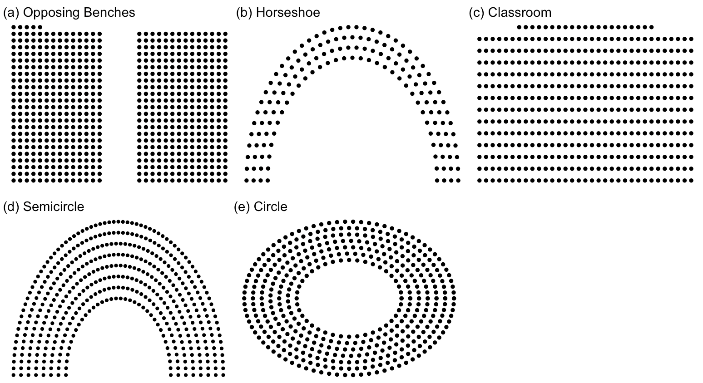

# Summary

`ggparliament` is an `R` [@R] package for visualizing legislative chambers. It allows for easy visualization of the party composition of a legislative body, or for plotting of election results, using `ggplot2` syntax. The package is one of the first `ggplot2` [@ggplot2] extensions for visualizing political data. It is considerably more detailed than most visualization tools for graphing legislatures in that it is designed to handle many different legislatures irrespective of size, number of parties, or characteristics of legislatures. The visualization output are known as 'parliament plots'.

Visualizing legislatures can be done in a variety of formats - usually in a JavaScript framework. `ggparliament` seeks to implement the flexibility from JavaScript in `R`. `R` users will find they can use a similar syntax to the popular `ggplot2` package to generate a visualization of a legislative body. In particular, `ggparliament` exists in `R` because it is a statistical computing language that many political scientists use in research (see pscl [@pscl], Amelia [@Amelia], MatchIt [@MatchIt], margins [@margins] for an incomplete list of `R` packages created for political science research). 

`ggparliament` is useful research tool for a variety of social science disciplines, including quantitative political science. It is particularly beneficial for political scientists who research political institutions, such as electoral systems, party politics, or legislative politics. `ggparliament` has several default layouts, representing different legislative chambers e.g. the United Kingdom's House of Commons, Australia's horseshoe-shaped parliament, or the widely-used semicircle legislative chamber. 



The standard syntax for a `ggparliament` plot is as follows:

```{r}
us_data <- ggparliament::election_data %>% 
  filter(country == "USA" & year == 2016 & 
           house == "Representatives") %>% 
  parliament_data(election_data = ., 
            parl_rows = 8, 
            party_seats = .$seats,
            type = 'semicircle')

ggplot(us_data, aes(x,y), colour = "black") + 
  geom_parliament_seats(size = 0.8) + 
  theme_ggparliament()
```

`ggparliament` has been designed with several key features in mind, including accessibility for academic researchers who may not want to learn how to visualize legislatures in JavaScript. It is also provides multiple layouts for different parliamentary systems, catering to researchers of various political systems. `ggparliament` items can be more complex than what we have detailed here. For example, it is possible to facet the ggparliament object over numerous elections or parliaments; this work is further explained in the package documentation. 

In this paper we present an R package to plot legislatures, also known as parliament plots. Parliament plots provide summary statistics for the distribution of a legislature, allowing users to view the number of seats per party. In addition,`ggparliament` visualizes descriptive data about legislators or legislative districts, and election results. 


# References
